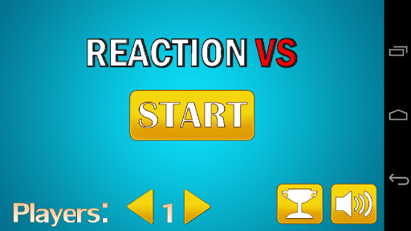
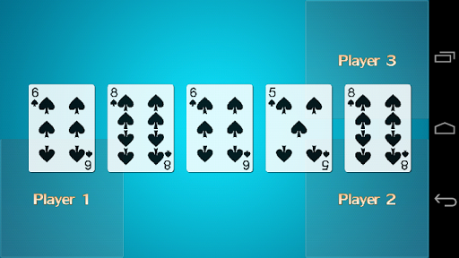
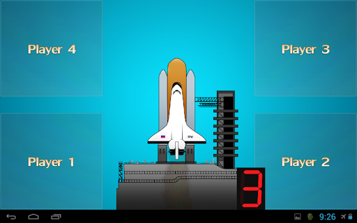

# Reaction VS
Reaction VS is a 1 to 4 player on the same phone/tablet reaction time game which used to be available for free.
> https://play.google.com/store/apps/details?id=com.kiyell.game.reactionvs.android (defunct)

> https://www.amazon.com/kiyell-Reaction-VS/dp/B00RASBNS8

The game was created using the [libgdx framework](https://libgdx.com/) and the primary gameplay screen is found at [core/src/com/kiyell/game/reactionvs/TrafficPlayScreen.java](core/src/com/kiyell/game/reactionvs/TrafficPlayScreen.java). All other game types were extensions of this basic game. Code, music, and graphics were all developed and designed by me.

Development and availability has since been retired but it was one of my first programming commercial products which taught me a lot about object oriented programming, mobile app development, and Java.

